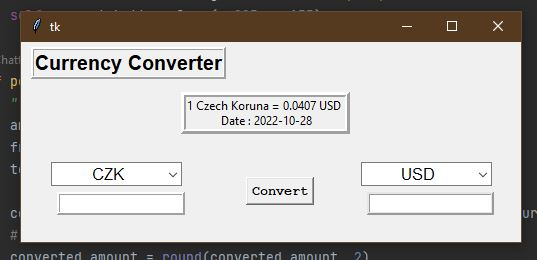
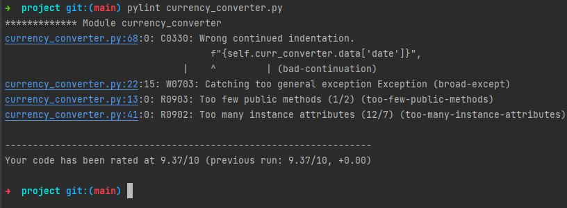

# Currency Converter - Python Project
version: 1.0.0

## Will Needs:
- PyCharm : can be downloaded from the list of resources below
- API URL : https://api.exchangerate-api.com/v4/latest/USD

## Prerequisite dependencies:
- requests : pip install requests
- tkinter : pip install tkinter
- re : import in

### Current UI

### Resources:
- [WS3 Schools: Regex](https://www.w3schools.com/python/python_regex.asp)
- [Tkinter](https://docs.python.org/3/library/tkinter.html)
- [Mark Down Guide](https://www.markdownguide.org/basic-syntax/)
- [PyCharm](https://www.jetbrains.com/pycharm/)
  - Python 
    - [Data Flair](https://data-flair.training/)
    - [Stack OverFlow](https://stackoverflow.com/)
    - [GeeksForGeeks](https://www.geeksforgeeks.org/python-programming-language/)
    - [Python Docs](https://docs.python.org/3/howto/functional.html)
  
### Stretch Goal
  - Fix:

